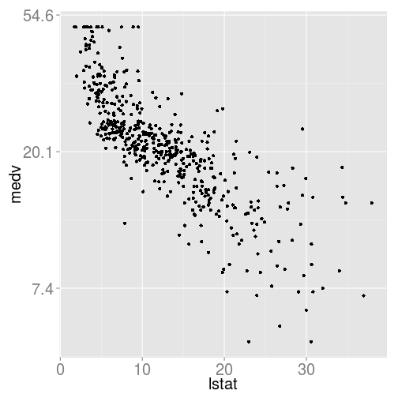

Graphically analyze using `ggplot2` the 1970 Boston housing dataset. This dataset consists of 14 variables with 506 observations. The target variable, `medv`, is the median owner-occupied home value in 1000's of dollars. The Boston dataset is found in the `MASS` package. 

```r
library(MASS)
data(Boston)
Boston$chas <-factor(Boston$chas, levels = c(0,1),
                     labels = c("Not on River", "On River"))
Boston$rad <-factor(Boston$rad)
head(Boston)
```

```
##      crim zn indus         chas   nox    rm  age    dis rad tax ptratio
## 1 0.00632 18  2.31 Not on River 0.538 6.575 65.2 4.0900   1 296    15.3
## 2 0.02731  0  7.07 Not on River 0.469 6.421 78.9 4.9671   2 242    17.8
## 3 0.02729  0  7.07 Not on River 0.469 7.185 61.1 4.9671   2 242    17.8
## 4 0.03237  0  2.18 Not on River 0.458 6.998 45.8 6.0622   3 222    18.7
## 5 0.06905  0  2.18 Not on River 0.458 7.147 54.2 6.0622   3 222    18.7
## 6 0.02985  0  2.18 Not on River 0.458 6.430 58.7 6.0622   3 222    18.7
##    black lstat medv
## 1 396.90  4.98 24.0
## 2 396.90  9.14 21.6
## 3 392.83  4.03 34.7
## 4 394.63  2.94 33.4
## 5 396.90  5.33 36.2
## 6 394.12  5.21 28.7
```

Fit a linear model to `log(medv)` using select predictors.

```r
attach(Boston)
Boston.lm <- lm(log(medv) ~ crim + chas + rad + lstat)
summary(Boston.lm)
```

```
## 
## Call:
## lm(formula = log(medv) ~ crim + chas + rad + lstat)
## 
## Residuals:
##      Min       1Q   Median       3Q      Max 
## -0.64352 -0.13733 -0.02115  0.10461  0.87218 
## 
## Coefficients:
##               Estimate Std. Error t value Pr(>|t|)    
## (Intercept)   3.428419   0.051028  67.187  < 2e-16 ***
## crim         -0.008905   0.001515  -5.876 7.73e-09 ***
## chasOn River  0.169177   0.039400   4.294 2.11e-05 ***
## rad2          0.214589   0.067157   3.195 0.001486 ** 
## rad3          0.204713   0.061187   3.346 0.000883 ***
## rad4          0.056412   0.054380   1.037 0.300072    
## rad5          0.167914   0.053908   3.115 0.001948 ** 
## rad6          0.091301   0.066334   1.376 0.169330    
## rad7          0.158928   0.073020   2.177 0.029990 *  
## rad8          0.216818   0.067290   3.222 0.001356 ** 
## rad24         0.094849   0.058213   1.629 0.103879    
## lstat        -0.039079   0.001667 -23.443  < 2e-16 ***
## ---
## Signif. codes:  0 '***' 0.001 '**' 0.01 '*' 0.05 '.' 0.1 ' ' 1
## 
## Residual standard error: 0.2213 on 494 degrees of freedom
## Multiple R-squared:  0.7134,	Adjusted R-squared:  0.707 
## F-statistic: 111.8 on 11 and 494 DF,  p-value: < 2.2e-16
```
All variables are highly significant.

See the variable descriptions using `help` in the `MASS` package.

### 1. Plot and discuss the distributions of the log of the median home value (`log(medv)`) faceted by both Charles River (`chas`) and radial highway location (`rad`). Does the log transformation inprove symmetry?


```r
library(ggplot2); library(scales)
## constant
f.size <- element_text(size=20)
this.theme <- theme(strip.text.x = f.size, strip.text.y = f.size,
                    axis.text.x = f.size, axis.text.y = f.size,
                    axis.title.x = f.size, axis.title.y = f.size)
b.width <- function(x) sum(c(-1, 1) * range(x))/12
medv.hist <- ggplot(Boston, aes(medv)) +
    facet_grid(chas ~ rad, margins=T) +
    this.theme
## plot
medv.hist + geom_histogram(aes(y = ..density..), binwidth=b.width(medv))
```

 

We can see that the median home prices are (mostly) centered around
\$20,000 across radial highway scores or whether
they're in riverfront neighborhoods.

As the accessibility of highways increases, we do tend to see more
right skew, suggesting that proximity to major highways raises the
value of the homes.  The one exception being that having a radial
index of 24 lowers the price of the bulk of the homes.  This may
indicate that the homes with access to the most radial highways are
the inner-city, which could be confounded with low-income housing.

The fact that there are few riverfront towns (only 36) makes
patterns hard to detect within the group, but on the aggregate we can
clearly see that having a house in a riverfront neighborhood does
introduce higher home values.

Having two large peaks in the riverfront
homes also suggests that we have two main populations of riverfront
property -- a poor and a rich section.

As we should expect from financial data, we do see right skew in all
groups, or at least those with enough members to give the histogram
some resolution. 


```r
fmt <- function(x) format(x, nsmall=1, digits=2)
medv.hist + geom_histogram(aes(y = ..density..), binwidth=b.width(log(medv))) +
    scale_x_continuous(trans=log_trans(), name="log(medv)", labels = fmt) +
    this.theme                 
```

 

As is typically seen, using a log-transform does give us mostly
symmetric distributions. Our overall patterns, however, remain
intact. Increasing the number of close radial highways generally
raises the home value (until you have too many), as does being close to
the river.

### 2. Plot and discuss the boxplot distributions of the log of the median home values (`log(medv)`) by the Charles River (`chas`) and separately by radial highway locations (`rad`). Draw horizontal lines at `mean(log(medv))` in each plot.


```r
plot.box <- function(box){
    box + 
    geom_boxplot() +
    scale_y_continuous(trans=log_trans(), name="log(medv)", labels=fmt) +
    geom_hline(yintercept=mean(medv)) +
    theme(legend.position="none")
}
plot.box(ggplot(Boston, aes(x=chas, y=medv, fill=chas)))
```

 

The distribution of the log-transformed median prices for riverfront homes is higher
than that of other properties and still skewed slightly to the right.

The non-riverfront properties have more outliers, especially on the
low side, giving us a slight left skew.


```r
plot.box(ggplot(Boston, aes(x=rad, y=medv, fill=rad)))
```

 

As we saw in the histograms, increasing the radial highway index
generally increases the median home value.  However, the
boxplots now reveal a more subtle pattern -- there are two distinct
increasing trends: from 1 to 3 and from 4 to 8. If the two groups are
considered as a whole, we see no overall trend. 

We also see that the distribution of median home values is lowest for
homes with an index of 24.  This group also has the most variability.
Again, this may point to median house prices in towns in a city center
being confounded with income. 

### 3. Explore graphically the relationship of crime (`crim`) to the log of the median home values (`log(medv)`) with and without faceting on the radial highway locations (`rad`). What difficulties do you see in using `crim` as a predictor?


```r
(gp <- ggplot(Boston, aes(y=log(medv), x=crim)) + geom_point() + this.theme)
```

 

```r
gp + facet_wrap(~ rad, ncol=2)
```

 

The most major issue that we can see is that crime variability is almost entirely
concentrated in towns with a highway index of 24.  This, again, points
us back to the highway index being confounded with inner-city areas,
which typically have higher crime rates.

Given that this is the case, almost all of the variability in crime is
contained in `rad=24`, and we'd likely have issues with variance inflation
and multicollinearity.  In other words, including `crim` and `rad24`
in the model would lower the significance of both variables.


```r
library(car)
vif(Boston.lm)
```

```
##           GVIF Df GVIF^(1/(2*Df))
## crim  1.752799  1        1.323933
## chas  1.033114  1        1.016422
## rad   1.985057  8        1.043784
## lstat 1.461797  1        1.209048
```

```r
vif(update(Boston.lm, .~. - crim))
```

```
##           GVIF Df GVIF^(1/(2*Df))
## chas  1.030458  1        1.015115
## rad   1.430971  8        1.022650
## lstat 1.395727  1        1.181409
```

### 4. To explore the the crime variable (`crim`):  
a.) Plot the density histogram of the log of crime (`log(crim)`). Superimpose a density curve.   
b.) Plot and discuss the boxplot distribution of crime (`crim`) relative to the radial highway locations (`rad`). Should crime be logged in the linear model?

a.)

```r
ggplot(Boston, aes(x=crim)) + geom_histogram(aes(y = ..density..),
                       fill="grey40", colour="black") +
    scale_x_continuous(trans=log_trans(), labels=fmt) +
    geom_density(color="red") +
    this.theme
```

```
## stat_bin: binwidth defaulted to range/30. Use 'binwidth = x' to adjust this.
```

 

b.)

```r
ggplot(Boston, aes(x=rad, y=crim, fill=rad)) + geom_boxplot() +
    this.theme
```

 
Again we see significant right skew, as well as a distinct lack of
variability in all `rad` categories but `rad=24`.


```r
ggplot(Boston, aes(x=rad, y=crim, fill=rad)) + geom_boxplot() +
    this.theme + scale_y_continuous(trans=log_trans(), labels=fmt)
```

 

The log transform gives us much more symmetric distributions, so using
it in the linear model will probably give us the best
results.  Additionally, we see that this adds some variability to
every category, and the boxes are all much closer in size.


### 5. To explore the effect of `lstat` on the model:  
a) Explore graphically the relationship of percent lower status
(`lstat`) to the log of the median home (`log(medv)`) values with and
without faceting on the radial highway locations (`rad`).  
b) Add linear fits overall and for each facet. Discuss the efficacy of
the fits and whether or not there appears to be an interaction between
`lstat` and `rad`.

a)

```r
(gp <- ggplot(Boston, aes(x=lstat, y=medv)) +
    geom_point() +
    scale_y_continuous(trans=log_trans(), labels=fmt) +
    this.theme)
```

 

There seems to be a fairly strong linear relationship between `lstat`
and the log of `medv` overall.


```r
(gp.f <- gp + facet_wrap(~ rad, ncol=2))
```

 

A linear pattern still holds within most of the `rad` factors, but
we can see in others that `log(medv)` is fairly constant across the
range of `lstat`.

b)

```r
gp + geom_smooth(method=lm, size=1.5)
```

 

```r
gp.f + geom_smooth(method=lm, size=1.5)
```

 

The slopes are all slightly to moderately negative across most levels
of `rad`.

Additionally, we can see that the fit is best (lowest residual
standard error) when `rad=4`, `rad=5`, `rad=6`, and `rad=24`  by the
width of the confidence bands. However, this may be more a function of
the small sample size within the other factor levels.

The most interesting feature may be the change in slopes between
factor levels, epitomized by the relative lack of slope when
`rad=6`. This is indicative of an interaction between `lstat` and
`rad`. 


